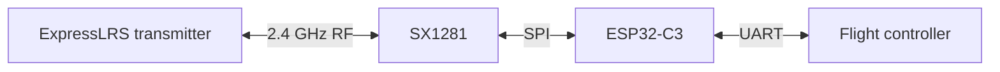

# 2.4 GHz ExpressLRS Receiver | ESP32-C3 + SX1281

A compact **20 mm × 15 mm** 2.4 GHz ExpressLRS receiver designed around an **ESP32-C3** microcontroller and **SX1281** RF transceiver. The board provides power and a UART connection to a flight controller.

> **Status:** The custom PCB was assembled, flashed and brought up, and receiver operation was tested on a drone. No range, latency or RF-compliance measurements are claimed here.

## Hardware

| Item | Implementation |
| --- | --- |
| MCU | ESP32-C3 |
| RF transceiver | SX1281, 2.4 GHz |
| Interface to flight controller | UART |
| Board size | 20 mm × 15 mm |
| Design tool | EasyEDA |
| PCB | Six layers |

The recorded layer order is **top / GND / 3.3 V / 3.3 V / GND / bottom**. Check the board revision's design files before ordering or modifying the PCB.

## Signal path



The RF link terminates at the SX1281; the ESP32-C3 runs the receiver firmware and communicates with the flight controller over UART. Check the schematic for the exact voltage, pads and pin assignments before wiring the board.

## Firmware: VS Code + PlatformIO

This custom receiver **was not flashed through ExpressLRS Configurator**: the board-specific DIY receiver is not listed there. I cloned the [ExpressLRS source repository](https://github.com/ExpressLRS/ExpressLRS), selected the **Generic ESP32-C3 2.4 GHz receiver** build, compiled it in **Visual Studio Code with the PlatformIO extension**, and flashed the receiver from that development workflow.

The tested receiver reported **ExpressLRS 4.1.0**, `UNIFIED_ESP32C3_2400_RX`, and an SX128X radio in its Web UI. The project artifacts include `AIRWINGS-ELRS-RX-4.1.0.bin` and `Generic-C3-2400-RX.json`. The Web UI's target identifier and the exact PlatformIO environment/task label can differ; select the task matching the ESP32-C3 **2.4 GHz RX** build in the source version you are using.

### Rebuild and flash

1. Install **Git**, [Visual Studio Code](https://code.visualstudio.com/) and the [PlatformIO IDE extension](https://docs.platformio.org/en/latest/integration/ide/vscode.html).
2. Clone the upstream source. To reproduce the tested firmware, select the matching **4.1.0 release source** rather than building an arbitrary newer revision:

   ```bash
   git clone https://github.com/ExpressLRS/ExpressLRS.git
   ```

3. In VS Code, open the cloned repository's **`src` directory** as a PlatformIO project (the directory containing its PlatformIO configuration). Choose the **Generic ESP32-C3 2.4 GHz RX** environment and review the user defines and hardware configuration for this board. Confirm the **SX1281/SX128X configuration, pin mapping, RF settings and UART pins** against the schematic and the board-specific JSON before building; the word *Generic* does not guarantee a correct pin map for another PCB.
4. Open **PlatformIO → Project Tasks → selected receiver environment → Build**. Wait for a successful build before connecting the board for flashing.
5. Connect the board using its actual programming interface and correct voltage. Select the corresponding serial port in PlatformIO. If the custom ESP32-C3 board has no automatic boot circuit, hold **GPIO9 low during reset** to enter its serial bootloader; **GPIO8 must be high** for reliable download mode. Then use that environment's **Upload** task. Follow the schematic for the physical programming pads and reset method; do not follow older ESP8285 DIY instructions that say to pull IO0 low.
6. Reset into normal boot, check the reported firmware/target in the Web UI, bind with a compatible ExpressLRS transmitter, and verify channel movement on the flight controller before flight.

The [ExpressLRS source-build guide](https://www.expresslrs.org/software/toolchain-install/) documents cloning, user defines, and PlatformIO Build/Upload tasks. [Espressif's ESP32-C3 boot-mode guide](https://docs.espressif.com/projects/esptool/en/latest/esp32c3/advanced-topics/boot-mode-selection.html) explains the GPIO9/GPIO8 requirements. The precise upload connection for **this PCB** must match its schematic.

The **same physical PCB** was also reconfigured and flashed for transmitter/telemetry experiments. This was a firmware/configuration reuse of the receiver hardware, not a redesigned telemetry PCB. Receiver operation on the drone does not by itself establish validated transmitter performance.

## Test status

- Custom board assembled and powered up.
- ExpressLRS source cloned, Generic ESP32-C3 2.4 GHz RX firmware built with PlatformIO in VS Code, flashed, and receiver configuration checked.
- Receiver function tested with a drone installation.

Detailed RF range, sensitivity, packet-loss and compliance figures have not been provided. Add reproducible measurements and test conditions if those are evaluated later.

## Author

**Nishant Patil**

No license has been specified for the project files. Add one if you want to define reuse terms.
