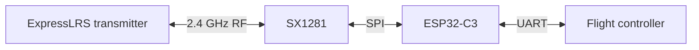

# 2.4 GHz ExpressLRS Receiver | ESP32-C3 + SX1281

A compact **20 mm × 15 mm** 2.4 GHz ExpressLRS receiver designed around an **ESP32-C3** microcontroller and **SX1281** RF transceiver. The board provides power and a UART connection to a flight controller.

> **Status:** The custom PCB was assembled, flashed and brought up, and receiver operation was tested on a drone. No range, latency or RF-compliance measurements are claimed here.

## Hardware

| Item | Implementation |
| --- | --- |
| MCU | ESP32-C3 |
| RF transceiver | SX1281, 2.4 GHz |
| Interface to flight controller | UART |
| Status indicator | On-board RGB LED for receiver state |
| Board size | 20 mm × 15 mm |
| Design tool | EasyEDA |
| PCB | Six layers |

The recorded layer order is **top / GND / 3.3 V / 3.3 V / GND / bottom**. Check the board revision's design files before ordering or modifying the PCB.

## Signal path



The RF link terminates at the SX1281; the ESP32-C3 runs the receiver firmware and communicates with the flight controller over UART. Check the schematic for the exact voltage, pads and pin assignments before wiring the board.

## Firmware: VS Code + PlatformIO

This custom receiver **was not flashed through ExpressLRS Configurator**: the board-specific DIY receiver is not listed there. I cloned the [ExpressLRS source repository](https://github.com/ExpressLRS/ExpressLRS), selected the **Generic ESP32-C3 2.4 GHz receiver** build, compiled it in **Visual Studio Code with the PlatformIO extension**, and flashed the receiver using a **USB-to-UART converter**. The PCB has a **BOOT button** for entering the ESP32-C3 download mode.

The tested receiver reported **ExpressLRS 4.1.0**, `UNIFIED_ESP32C3_2400_RX`, and an SX128X radio in its Web UI. The project artifacts include `AIRWINGS-ELRS-RX-4.1.0.bin` and `Generic-C3-2400-RX.json`. The Web UI's target identifier and the exact PlatformIO environment/task label can differ; select the task matching the ESP32-C3 **2.4 GHz RX** build in the source version you are using.

### Rebuild and flash

1. Install **Git**, [Visual Studio Code](https://code.visualstudio.com/) and the [PlatformIO IDE extension](https://docs.platformio.org/en/latest/integration/ide/vscode.html).
2. Clone the upstream source. To reproduce the tested firmware, select the matching **4.1.0 release source** rather than building an arbitrary newer revision:

   ```bash
   git clone https://github.com/ExpressLRS/ExpressLRS.git
   ```

3. In VS Code, open the cloned repository's **`src` directory** as a PlatformIO project (the directory containing its PlatformIO configuration). Choose the **Generic ESP32-C3 2.4 GHz RX** environment and review the user defines and hardware configuration for this board. Confirm the **SX1281/SX128X configuration, pin mapping, RF settings and UART pins** against the schematic and the board-specific JSON before building; the word *Generic* does not guarantee a correct pin map for another PCB.
4. Open **PlatformIO → Project Tasks → selected receiver environment → Build**. Wait for a successful build before connecting the board for flashing.
5. Connect a **USB-to-UART converter** to the receiver's programming pads: converter **TX → receiver RX**, converter **RX → receiver TX**, and **GND → GND**. Power the receiver as specified by the schematic and use **3.3 V logic levels** at the ESP32-C3 UART. Check whether the converter should also supply power to this PCB before connecting its VCC pin; do not connect two power sources blindly.
6. Hold the receiver's **BOOT button** and reset or power-cycle the board so the ESP32-C3 enters download mode, then release BOOT. Select the converter's COM/serial port and use the selected PlatformIO receiver environment's **Upload** task. On the ESP32-C3, download mode normally uses **GPIO9 low at reset** and **GPIO8 high**; consult the board schematic if the button or strap wiring differs. Older ESP8285 DIY instructions that pull IO0 low do not describe the ESP32-C3 boot pins.
7. After upload, disconnect the flashing setup as appropriate, reset into normal boot without holding BOOT, check the reported firmware/target in the Web UI, bind with a compatible ExpressLRS transmitter, and verify channel movement on the flight controller before flight.

The [ExpressLRS source-build guide](https://www.expresslrs.org/software/toolchain-install/) documents cloning, user defines, and PlatformIO Build/Upload tasks. [Espressif's ESP32-C3 boot-mode guide](https://docs.espressif.com/projects/esptool/en/latest/esp32c3/advanced-topics/boot-mode-selection.html) explains the GPIO9/GPIO8 requirements. Use this PCB's schematic for the exact BOOT, UART and power-pad locations.

## RGB LED status

The receiver has an **RGB status LED**. With an ExpressLRS receiver build configured for this LED, the [official ExpressLRS receiver RGB LED guide](https://www.expresslrs.org/quick-start/led-status/) describes these patterns:

| RGB LED indication | Receiver state |
| --- | --- |
| Rainbow fade | Starting up |
| Slow blink (about 500 ms on/off) | Waiting for a transmitter |
| Orange double blink, then pause | Binding mode |
| Orange triple blink, then pause | Connected, but model-match settings differ |
| Solid single color | Connected; color indicates the selected packet rate |
| Green heartbeat | Web update mode |
| Rapid red flashing | Radio chip not detected |
| No light | Powered off or in bootloader mode |

The [same guide](https://www.expresslrs.org/quick-start/led-status/) lists the **2.4 GHz packet-rate color mapping**. These are ExpressLRS firmware indications; check the board's RGB LED wiring and target configuration if its behavior differs.

The **same physical PCB** was also reconfigured and flashed for transmitter/telemetry experiments. This was a firmware/configuration reuse of the receiver hardware, not a redesigned telemetry PCB. Receiver operation on the drone does not by itself establish validated transmitter performance.

## Test status

- Custom board assembled and powered up.
- ExpressLRS source cloned, Generic ESP32-C3 2.4 GHz RX firmware built with PlatformIO in VS Code, flashed through a USB-to-UART converter using the board's BOOT button, and receiver configuration checked.
- Receiver function tested with a drone installation.

Detailed RF range, sensitivity, packet-loss and compliance figures have not been provided. Add reproducible measurements and test conditions if those are evaluated later.

## Author

**Nishant Patil**

No license has been specified for the project files. Add one if you want to define reuse terms.
